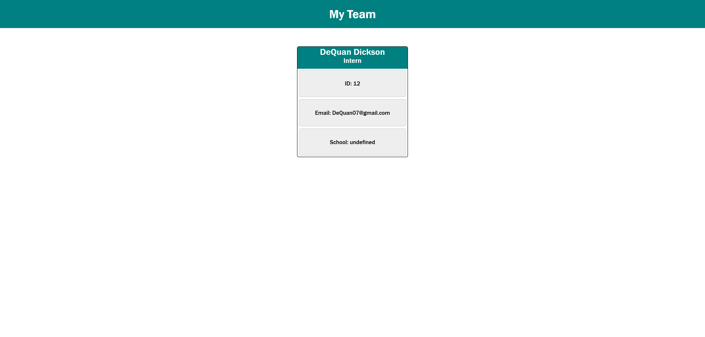

# My Team Builder 
  
  # Description
  A Node command line app, that generates a HTML page consisting of team members based on the input provide by the user.
  # Image 
  
  ## Table of Contents
 * [Installation](#installation)
 * [Usage](#usage)
 * [Test](#test)
 * [Contributions](#contributions)
 * [License](#license)
  
  # Installation
  npm i

  # Usage
  node index

  # Test
  npm test

  # Contributions
  Any input is appreciated. Please contact me for any of the following:
 - Reporting a bug
 - Discussing the current state of the code
 - Submitting a fix
 - Proposing new features
 - Becoming a maintainer

  # License
 Licensed under the  [MIT](https://opensource.org/licenses/MIT) license
 

  # Questions

  If you have any questions about this project please don't hesitate to contact me via GitHub: https://github.com/https://github.com/DeQuanD or my email: DeQuan07@gmail.com

